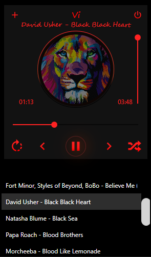

# Vi
Аудиоплеер

Свой аудиоплеер сделанный в WPF

Аудиоплеер очень простой, но в тоже время есть весь основной функционал.

Основа разметки взята из одного OpenSource проекта.

Программа не реализована с использованием паттернов проектирования

