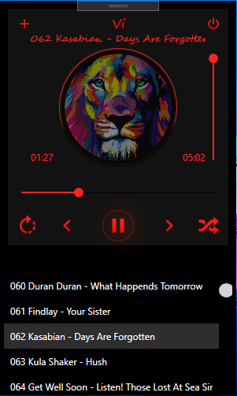

# Vi
Аудиоплеер

Свой аудиоплеер сделанный в WPF
Полностью рабочий функционал.
Аудиоплеер очень простой, но в тоже время есть весь основной функционал.
Основа разметки взята из одного OpenSource проекта.
К сожалению я не пушил коммиты в удаленный репозиторий, а все локальные коммиты были уничтожены в результате ошибки работы VS, поэтому только 1 коммит.
В данный момент программа не реализована пока под паттерн MVVM, но позже переделаю логику приложения под паттерн MVVM.

